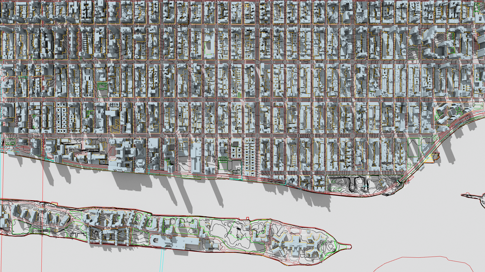

[](https://opensource.org/licenses/BSD-3-Clause)

Overview
========
Osprey is an open source plugin that integrates the OSPRay renderer with
the Rhino 3D modeler. OSPRay is an "open source, scalable, and portable ray
tracing engine for high-performance, high-fidelity visualization on Intel
Architecture CPUs."

Robert McNeel & Associates Rhino: https://www.rhino3d.com<br>
Intel OSPRay: https://www.ospray.org/

This plugin is in the early stages of development and is currently only released
as source code.


Features
========
Completed or in-progress:
* Meshes
* Extrusions
* BReps
* Blocks
* Basic materials
* Ground plane
* Lines
* Perspective cameras
* Ortho cameras
* Sun
* Render settings UI

TODO:
* Lights - https://github.com/darbyjohnston/Osprey/issues/2
* Create render meshes - https://github.com/darbyjohnston/Osprey/issues/3
* Backgrounds - https://github.com/darbyjohnston/Osprey/issues/4
* Environments - https://github.com/darbyjohnston/Osprey/issues/5
* Groups - https://github.com/darbyjohnston/Osprey/issues/6
* Points - https://github.com/darbyjohnston/Osprey/issues/7
* Curves - https://github.com/darbyjohnston/Osprey/issues/8
* PBR materials - https://github.com/darbyjohnston/Osprey/issues/9
* Textures - https://github.com/darbyjohnston/Osprey/issues/10
* Async rendering - https://github.com/darbyjohnston/Osprey/issues/11
* Interactive viewport rendering - https://github.com/darbyjohnston/Osprey/issues/12
* Add macOS support - https://github.com/darbyjohnston/Osprey/issues/13
* Binary packages - https://github.com/darbyjohnston/Osprey/issues/14
* Previews - https://github.com/darbyjohnston/Osprey/issues/15
* Continuous integration builds - https://github.com/darbyjohnston/Osprey/issues/16


Renders
=======
### NYC
These scenes are from data sets of New York City provided by BYTES of the BIG
APPLE:
https://www1.nyc.gov/site/planning/data-maps/open-data/dwn-nyc-3d-model-download.page

The scene MN01 consists of 132255 model components with a file size of about
350MB:
https://www1.nyc.gov/assets/planning/download/zip/data-maps/open-data/nyc-3d-model/nyc_3dmodel_mn01.zip

The scene MN08 consists of 366474 model components with a file size of about
950MB:
https://www1.nyc.gov/assets/planning/download/zip/data-maps/open-data/nyc-3d-model/nyc_3dmodel_mn08.zip

The scenes were opened in Rhino and modified with the following:
* Added a sun
* Added a ground plane
* Added a new material for the buildings
* Enabled the skylight with an intensity of 0.3 and the default custom environment
* Enabled curve rendering
* Set the render gamma to 2.2 and enabled the linear workflow
* Set the backdrop to the solid color: 65, 100, 170

OSPRay renderer settings:
* Resolution: 1920x1080
* Passes: 8
* Pixel samples: 1
* Ambient occlusion samples: 16
* Denoiser: Enabled
* Building diffuse color: 140, 160, 175

Rhino 6 renderer settings:
* Resolution: 1920x1080
* Quality: Good
* Building diffuse color: 220, 240, 250

Test machines:
* Xeon E5-1630 v4 4 Cores @ 3.7GHz, 64GB RAM, Windows 10
* Ryzen 7 1700 8 cores @ 3.0GHz, 16GB RAM, Windows 10

#### MN01 Camera 1, OSPRay Path Tracer

* Xeon E5-1630: 1m 27s
* Ryzen 7 1700: 1m 9s

#### MN01 Camera 1, OSPRay SciVis Renderer

* Xeon E5-1630: 1m 24s
* Ryzen 7 1700: 1m 12s

#### MN01 Camera 1, Rhino 6 Renderer

* Xeon E5-1630: 11m 41s
* Ryzen 7 1700: 2m 50s

#### MN01 Camera 2, OSPRay Path Tracer

* Xeon E5-1630: 1m 16s
* Ryzen 7 1700: 1m 5s

#### MN01 Camera 2, OSPRay SciVis Renderer

* Xeon E5-1630: 1m 24s
* Ryzen 7 1700: 57s

#### MN01 Camera 2, Rhino 6 Renderer

* Xeon E5-1630: 8m 16s
* Ryzen 7 1700: 2m 20s

#### MN08 Camera 1, OSPRay Path Tracer

* Xeon E5-1630: 1m 53s
* Ryzen 7 1700: 1m 22s

#### MN08 Camera 1, OSPRay SciVis Renderer

* Xeon E5-1630: 1m 31s
* Ryzen 7 1700: 1m 10s

#### MN08 Camera 1, Rhino 6 Renderer

* Xeon E5-1630:  13m 29s
* Ryzen 7 1700: 6m 8s

#### MN08 Camera 2, OSPRay Path Tracer

* Xeon E5-1630: 2m 10s
* Ryzen 7 1700: 1m 26s

#### MN08 Camera 2, OSPRay SciVis Renderer

* Xeon E5-1630: 1m 48s
* Ryzen 7 1700: 1m 25s

#### MN08 Camera 2, Rhino 6 Renderer

* Xeon E5-1630: 19m 13s
* Ryzen 7 1700: 16m 49s


Building the Plugin
===================
Requirements:
* Visual Studio 2017
* Rhino 6 SDK - https://www.rhino3d.com/download/Rhino-SDK/6.0/release
* Git - https://git-scm.com/
* CMake - https://cmake.org/

#### Building OSPRay
Open a Visual Studio 2017 x64 Native Tools Command Prompt. Choose a directory
and clone the repository:
```
> git clone https://github.com/ospray/ospray.git
```

Create a directory for the build and run CMake:
```
> mkdir ospray-build
> cd ospray-build
> cmake ../ospray/scripts/superbuild -G "NMake Makefiles" -DINSTALL_IN_SEPARATE_DIRECTORIES=FALSE -DBUILD_OIDN=TRUE -DBUILD_OIDN_FROM_SOURCE=TRUE
```

Start the build:
```
> nmake
```

After the build is finished OSPRay will be installed in the "install"
sub-directory.

Open the control panel and add a new environment variable called
"OSPRAY_INSTALL". Set the value to the full path of the "install" sub-directory.

#### Building the Osprey Plugin
Open a Visual Studio 2017 x64 Native Tools Command Prompt. Choose a directory
and clone the repository:
```
> git clone https://github.com/darbyjohnston/Osprey.git
```

Open the "Osprey.sln" file with Visual Studio 2017 and start debugging. When the
build has finished Rhino will start automatically.

Install the Osprey plugin from the menu "Tools/Options...". The plugin is named
"Osprey.rhp" and is located in the sub-directory "x64\Debug" or "x64\Release"
depending on your build configuration. Note that if you change the build
configuration you will need to reinstall the plugin.


Contributing
============
#### Contributing Code
The following steps provide an example of how to make changes to the code.

Fork the repository using the GitHub website and clone it to your local
machine:
```
> git clone https://github.com/you/Osprey.git
> cd Osprey
```

Add the upstream repository to keep your source code up to date:
```
> git remote add upstream https://github.com/darbyjohnston/Osprey.git
```

Create a new branch for your work:
```
> git checkout -b mychange
```

Fetch and merge the latest changes:
```
> git fetch upstream
> git merge upstream/master
```

When making your change please follow the coding convention and style of the
file you are working in.

Once the change is ready create a pull request on GitHub.


Legal
=====
#### License
Copyright (c) 2020 Darby Johnston, All rights reserved

Redistribution and use in source and binary forms, with or without modification,
are permitted provided that the following conditions are met:

1. Redistributions of source code must retain the above copyright notice, this
   list of conditions and the following disclaimer.
2. Redistributions in binary form must reproduce the above copyright notice,
   this list of conditions and the following disclaimer in the documentation
   and/or other materials provided with the distribution.
3. Neither the name of the copyright holder nor the names of its contributors
   may be used to endorse or promote products derived from this software without
   specific prior written permission.

THIS SOFTWARE IS PROVIDED BY THE COPYRIGHT HOLDERS AND CONTRIBUTORS "AS IS" AND
ANY EXPRESS OR IMPLIED WARRANTIES, INCLUDING, BUT NOT LIMITED TO, THE IMPLIED
WARRANTIES OF MERCHANTABILITY AND FITNESS FOR A PARTICULAR PURPOSE ARE
DISCLAIMED. IN NO EVENT SHALL THE COPYRIGHT HOLDER OR CONTRIBUTORS BE LIABLE FOR
ANY DIRECT, INDIRECT, INCIDENTAL, SPECIAL, EXEMPLARY, OR CONSEQUENTIAL DAMAGES
(INCLUDING, BUT NOT LIMITED TO, PROCUREMENT OF SUBSTITUTE GOODS OR SERVICES;
LOSS OF USE, DATA, OR PROFITS; OR BUSINESS INTERRUPTION) HOWEVER CAUSED AND ON
ANY THEORY OF LIABILITY, WHETHER IN CONTRACT, STRICT LIABILITY, OR TORT
(INCLUDING NEGLIGENCE OR OTHERWISE) ARISING IN ANY WAY OUT OF THE USE OF THIS
SOFTWARE, EVEN IF ADVISED OF THE POSSIBILITY OF SUCH DAMAGE.

#### Third Party Software
This software is based in part on the works of (in alphabetical order):
* OSPRay - (C) 2013–2020 Intel Corporation
* Rhino SDK - Copyright (c) 1993-2017 Robert McNeel & Associates. All rights
  reserved.

#### Trademarks
Trademarks named in the documentation (in alphabetical order):
* AMD is a trademark of Advanced Micro Devices, Inc.
* AMD Ryzen is a registered trademark of Advanced Micro Devices, Inc.
* BYTES of the BIG APPLE is a registered trademark of the City of New York
* Intel, the Intel logo, Xeon, Intel Xeon Phi, and Intel Core are trademarks of
  Intel Corporation in the U.S. and/or other countries
* Microsoft, Microsoft Windows, and Visual Studio are registered trademarks of
  Microsoft, Inc.
* Rhinoceros is a registered trademark of Robert McNeel & Associates
